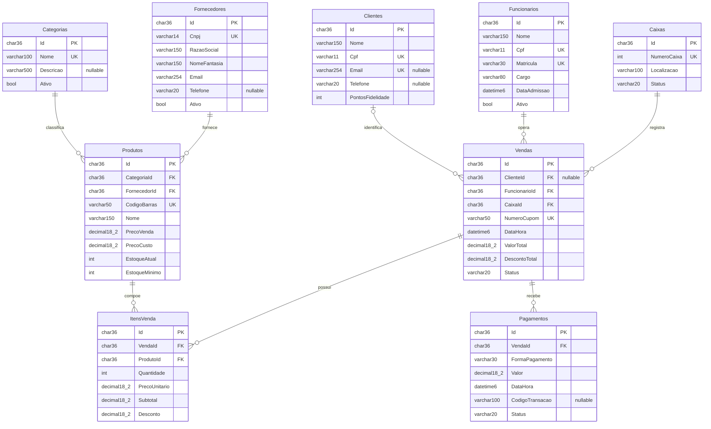

# Esquema físico — Supermercado

Modelo gerado pela única migration InitialCreate. As nove entidades e os GUIDs do CP1 foram mantidos; o CP2 explicita tipos, tamanhos, nullability, FKs, índices e comportamento de exclusão.

O diagrama mostra a cardinalidade permitida pelo banco. Vendas podem existir abertas sem itens/pagamentos; exigir itens para finalizar depende de regra de aplicação. ItemVenda materializa o N:N entre produtos e vendas. Não foram adicionadas entidades artificiais para criar 1:1 ou TPH, ausentes do domínio original.

A definição SQL exata, com nomes de constraints e índices, está em [schema.sql](schema.sql).
